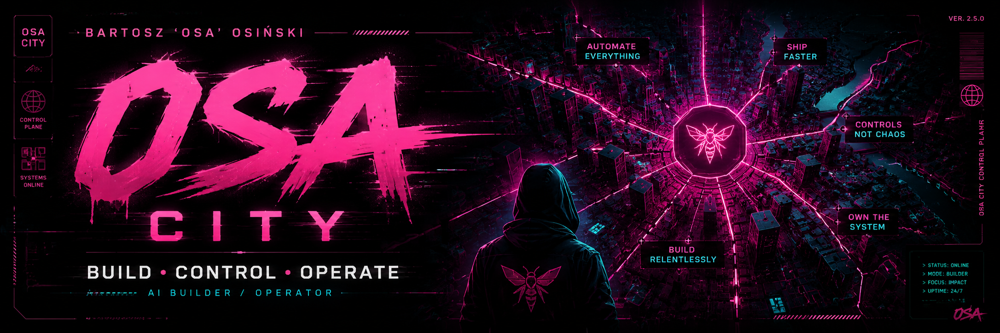
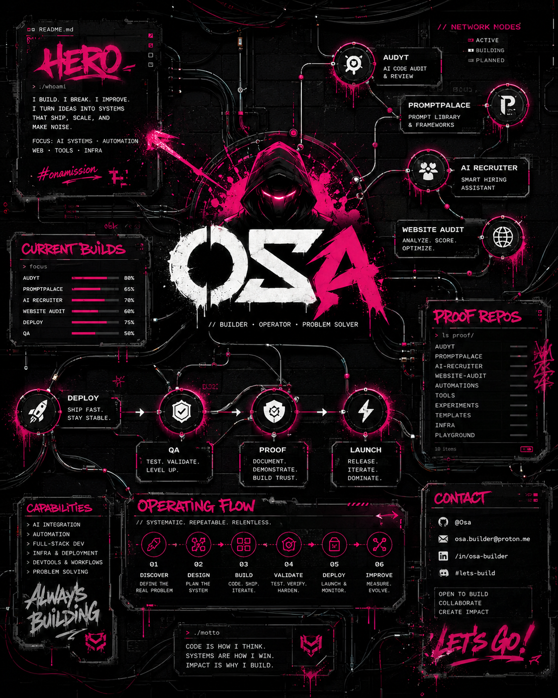
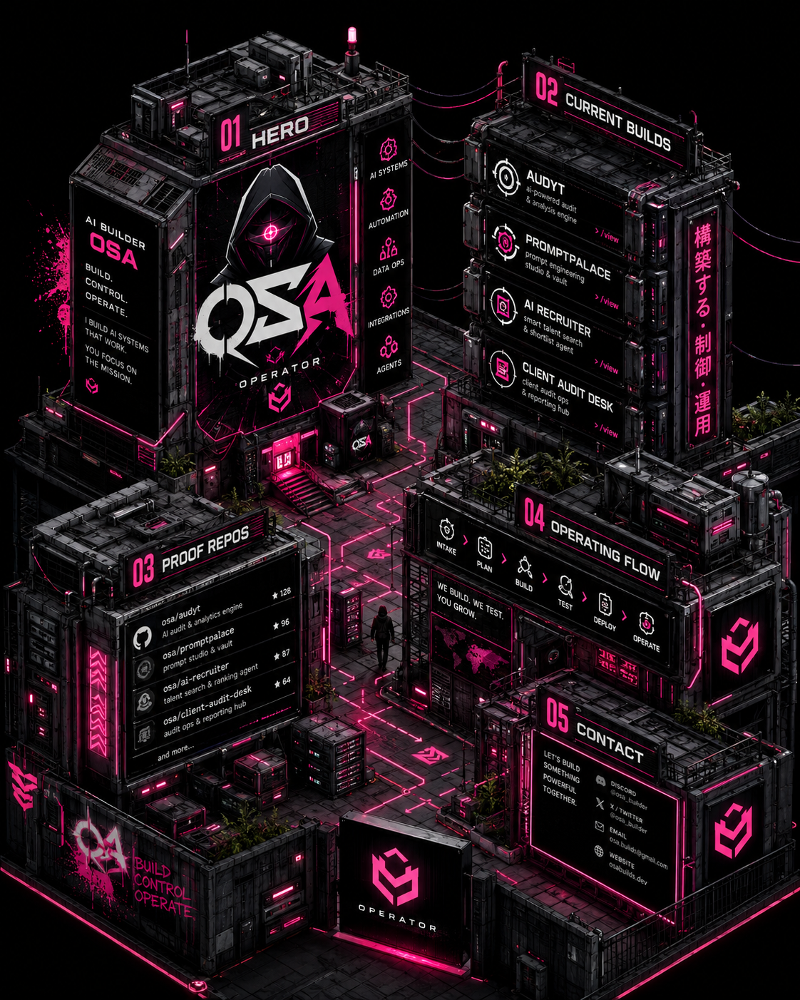
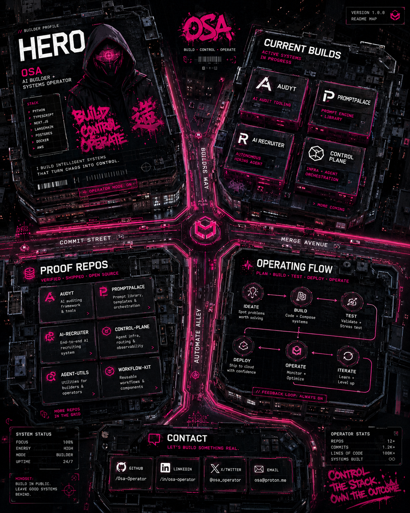
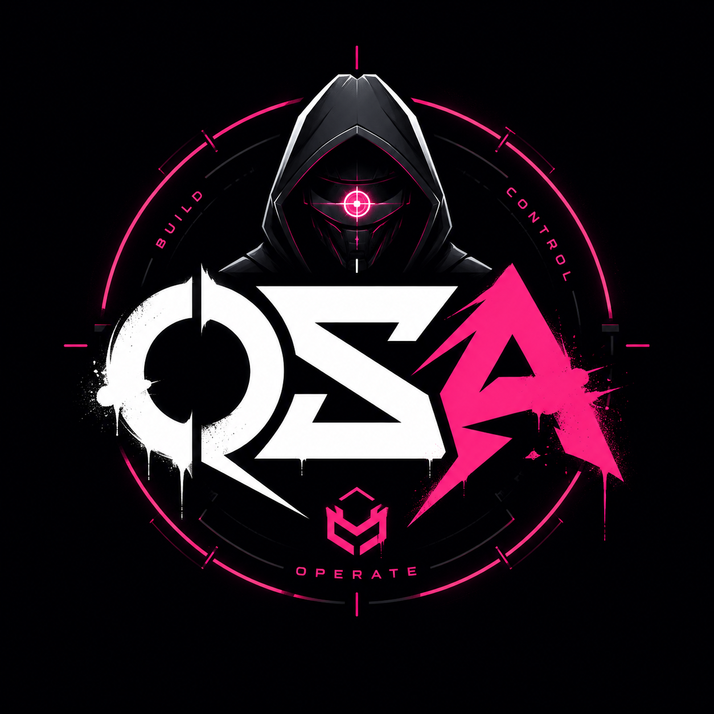

<!--
README.md v0.4 — OSA CITY SCROLL
Repo: HazEOskA/HazEOskA
Structure: ASCII → text → graphic → ASCII → text → graphic
Rule: GitHub profile as a cyberpunk builder map, not a standard CV.
-->

<div align="center">

```txt
 ██████╗ ███████╗ █████╗      ██████╗██╗████████╗██╗   ██╗
██╔═══██╗██╔════╝██╔══██╗    ██╔════╝██║╚══██╔══╝╚██╗ ██╔╝
██║   ██║███████╗███████║    ██║     ██║   ██║    ╚████╔╝
██║   ██║╚════██║██╔══██║    ██║     ██║   ██║     ╚██╔╝
╚██████╔╝███████║██║  ██║    ╚██████╗██║   ██║      ██║
 ╚═════╝ ╚══════╝╚═╝  ╚═╝     ╚═════╝╚═╝   ╚═╝      ╚═╝

        AI BUILDER MAP · PROOF REPO STREET · GOD LAYER ROAD
```

</div>

<p align="center">
  <b>AI Builder / Operator · Product Factory · Proof-Driven Systems</b><br/>
  <code>BUILD · CONTROL · OPERATE</code>
</p>

<p align="center">
  
</p>

---

```txt
┌─────────────────────────────────────────────────────────────────────────────┐
│ 00 // CITY GATE                                                             │
│ Incoming signal: operator profile detected                                  │
│ Mission: turn ideas into working systems with repo, demo, validation, proof │
└─────────────────────────────────────────────────────────────────────────────┘
```

I build AI-assisted systems, automation workflows, audit tools, agent prototypes and operator dashboards.

This GitHub is not a random repo warehouse.  
It is a **builder map**: districts, streets, proof repos, live demos, experiments and control systems.

```txt
IDEA → ARCHITECTURE → REPO → BUILD → LIVE TEST → VALIDATION → DEPLOY → PROOF
```

I do not treat AI as a chatbot.  
I treat AI like a machine that needs architecture, control, validation and operating rules.

---

<p align="center">
  
</p>

```txt
┌─────────────────────────────────────────────────────────────────────────────┐
│ 01 // CITY MAP                                                              │
│ Streets are workflows. Buildings are repos. Gates are validation checkpoints │
└─────────────────────────────────────────────────────────────────────────────┘
```

```txt
                              [ GOD LAYER TOWER ]
                                      ▲
                                      │
                              [ CONTROL PLANE ]
                                      ▲
                                      │
        ┌─────────────────────────────┼─────────────────────────────┐
        │                             │                             │
 [ AUDIT DISTRICT ]          [ AGENT DISTRICT ]           [ PRODUCT FACTORY ]
        │                             │                             │
   Audyt Repo                 PromptPalace OS              AI Recruiter OS
   Client Audit Desk          Osa Prompt Firewall          Workflow Systems
        │                             │                             │
        └───────────────────[ PROOF REPO STREET ]──────────────────┘
                                      │
                              [ LIVE DEMO GATE ]
                                      │
                              [ CONTACT / WORK ]
```

---

```txt
┌─────────────────────────────────────────────────────────────────────────────┐
│ 02 // CURRENT BUILDS DISTRICT                                               │
│ Active systems, prototypes, experiments and proof lanes                      │
└─────────────────────────────────────────────────────────────────────────────┘
```

### 🧪 Audit District

Tools for checking websites, finding weak points and turning messy client sites into clear improvement reports.

```txt
USE CASES:
- local business website audits
- client discovery
- demo generation
- improvement reports
- sales conversation support
```

Repos:

- [`Audyt`](https://github.com/HazEOskA/Audyt)
- [`Client-Website-Audit-Desk`](https://github.com/HazEOskA/Client-Website-Audit-Desk)

### 🧠 Product Factory District

A personal AI product factory for creating, testing and organizing apps, workflows, agents and client-ready demos.

```txt
FOCUS:
- project intake
- architecture lock
- repo generation
- execution flow
- live QA
- deployment proof
- changelog and decision logs
```

Systems:

- `workflow-control-plane` — internal command center / project control plane
- `animatedportfolioOsa` — public proof / portfolio showroom layer

### 🏛️ Prompt Palace District

Reusable prompt systems, workflow loops, AI rules and operator-ready templates.

Repo:

- [`promptpalace-os`](https://github.com/HazEOskA/promptpalace-os)

### 👥 Recruitment Automation District

Experiments around AI-assisted recruitment systems, CV generation, candidate workflows and launch tools.

Repo:

- [`AI-Recruiter-Launch-OS`](https://github.com/HazEOskA/AI-Recruiter-Launch-OS)

### 🛡️ Agent Safety / Firewall District

Concepts and prototypes for safer AI workflows: untrusted input filtering, prompt-injection awareness, review gates and proof logs.

```txt
DIRECTION:
Untrusted emails, pages, docs and CRM messages should not go straight into agents without checks.
```

Examples:

- Osa Prompt Firewall
- SYZYF Engine
- Pinokio Guard
- HRAR stop protocol

---

<p align="center">
  
</p>

```txt
┌─────────────────────────────────────────────────────────────────────────────┐
│ 03 // PROOF REPO STREET                                                     │
│ No repo should stay as a dead folder. Every repo needs purpose and proof     │
└─────────────────────────────────────────────────────────────────────────────┘
```

| Building | Repo | Purpose | Status |
|---|---|---|---|
| 🧪 Audit Tower | [`Audyt`](https://github.com/HazEOskA/Audyt) | Polish-first website audit app | Public proof |
| 🧾 Client Desk | [`Client-Website-Audit-Desk`](https://github.com/HazEOskA/Client-Website-Audit-Desk) | Client website audit workflow | Public proof |
| 👥 Recruiter Lab | [`AI-Recruiter-Launch-OS`](https://github.com/HazEOskA/AI-Recruiter-Launch-OS) | HR / recruitment automation | Public proof |
| 🏛️ Prompt Palace | [`promptpalace-os`](https://github.com/HazEOskA/promptpalace-os) | Prompt and workflow operating system | Public proof |
| 🕹️ Control Tower | `workflow-control-plane` | Operator command center | Internal / private |
| 🎞️ Showroom Gate | `animatedportfolioOsa` | Portfolio and proof layer | Demo / private |

```txt
REPO RULE:
No repo should stay as a dead folder.
Every important repo needs purpose, status, screenshot/demo and next step.
```

---

```txt
┌─────────────────────────────────────────────────────────────────────────────┐
│ 04 // OPERATING FLOW ROAD                                                   │
│ The route from idea to shipped proof                                        │
└─────────────────────────────────────────────────────────────────────────────┘
```

My standard build route:

```txt
Project Intake
→ Market Angle
→ Feature Map
→ Design Direction
→ Architecture Lock
→ Repo Generation
→ Build
→ Live App Test
→ Code Review
→ Deploy
→ Post-Deploy Validation
→ Launch Pack
→ Changelog / Decisions
```

For bigger projects I lock seven layers before execution:

```txt
1. Tools
2. Architecture
3. Repo Structure
4. Execution Flow
5. Validation Flow
6. Deployment Flow
7. Rollback / Safety Plan
```

---

<p align="center">
  
</p>

```txt
┌─────────────────────────────────────────────────────────────────────────────┐
│ 05 // BOSS LEVELS                                                           │
│ Problems are not hidden. They become checkpoints                            │
└─────────────────────────────────────────────────────────────────────────────┘
```

```txt
[✓] Blank Portfolio          → replaced with proof systems
[✓] Random Repo Chaos        → moved toward project control plane
[✓] AI Drift                 → handled through session logs and proof rules
[✓] No Validation            → replaced with live QA and post-deploy checks
[✓] “Done” Without Evidence  → replaced with changelog, demo and proof
[~] Public Showroom Layer    → currently building
[~] Repeatable Product Flow  → currently building
```

---

```txt
┌─────────────────────────────────────────────────────────────────────────────┐
│ 06 // BUILDER CODE                                                          │
│ Operator logic in public form                                               │
└─────────────────────────────────────────────────────────────────────────────┘
```

```ts
const osa = {
  mode: ["build", "control", "operate"],
  focus: ["AI systems", "automation", "audit tools", "agent workflows"],
  rule: "No fake certainty. No invisible work. No done without proof.",
  flow: "idea → architecture → repo → build → test → deploy → proof",
};

while (building) {
  defineTools();
  lockArchitecture();
  generateRepoStructure();
  buildSmall();
  validateLive();
  documentProof();
  shipOrRollback();
}
```

---

```txt
┌─────────────────────────────────────────────────────────────────────────────┐
│ 07 // PROOF RULES                                                           │
│ No launch without evidence                                                  │
└─────────────────────────────────────────────────────────────────────────────┘
```

Every serious project must answer:

```txt
What problem does it solve?
Who is it for?
Is there a repo?
Is there a live demo or screenshot?
What is already validated?
What is still blocked?
What changed in the last session?
What is the next concrete step?
```

Rules:

```txt
NO FAKE CERTAINTY
NO INVISIBLE WORK
NO “DONE” WITHOUT PROOF
NO UNCONTROLLED REPO CHAOS
NO AGENT DRIFT WITHOUT AUDIT
NO LAUNCH WITHOUT VALIDATION
```

---

<p align="center">
  
</p>

```txt
┌─────────────────────────────────────────────────────────────────────────────┐
│ 08 // STACK DISTRICT                                                        │
│ Tools are selected for speed, control, deployability and proof              │
└─────────────────────────────────────────────────────────────────────────────┘
```

```txt
AI / Agents:
ChatGPT · Claude · Codex · GLM · custom agent workflows

Frontend:
Next.js · React · TypeScript · Tailwind

Backend / Data:
Node.js · Supabase · Postgres · APIs

Deploy:
Vercel · Netlify · Railway · VPS

QA:
Playwright · browser testing · live validation

Workflow:
GitHub · VS Code · Android / DeX · session logs · changelogs
```

---

```txt
┌─────────────────────────────────────────────────────────────────────────────┐
│ 09 // SIDE STREETS                                                          │
│ Not every lane is a product yet. Some lanes are research and weapons testing │
└─────────────────────────────────────────────────────────────────────────────┘
```

```txt
AI Automation Street        → workflows, agents, operating procedures
Audit Alley                 → website reports, client demos, local business tools
Prompt Palace Road          → prompt systems, reusable patterns, templates
Deploy Gate                 → live validation, launch checks, rollback plans
Proof Repo Street           → public work, screenshots, demos, changelogs
God Layer Road              → operator control, architecture, decision ownership
```

---

```txt
┌─────────────────────────────────────────────────────────────────────────────┐
│ 10 // CONTACT GATE                                                          │
│ Work signal exits here                                                      │
└─────────────────────────────────────────────────────────────────────────────┘
```

GitHub: [@HazEOskA](https://github.com/HazEOskA)  
Email: [osabarca@gmail.com](mailto:osabarca@gmail.com)

```txt
OPEN TO:
- AI workflow systems
- website audit tools
- automation prototypes
- product MVPs
- agent workflow architecture
- proof-driven build systems
```

---

<div align="center">

```txt
I DO NOT COLLECT RANDOM PROJECTS.
I BUILD A CITY OF SYSTEMS.

EVERY STREET HAS A PURPOSE.
EVERY REPO NEEDS PROOF.
EVERY BUILD MUST SURVIVE VALIDATION.
```

**Build. Control. Operate.**

</div>
